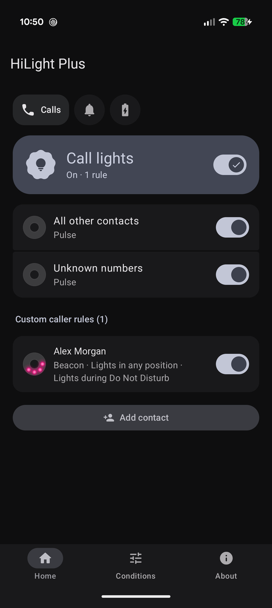
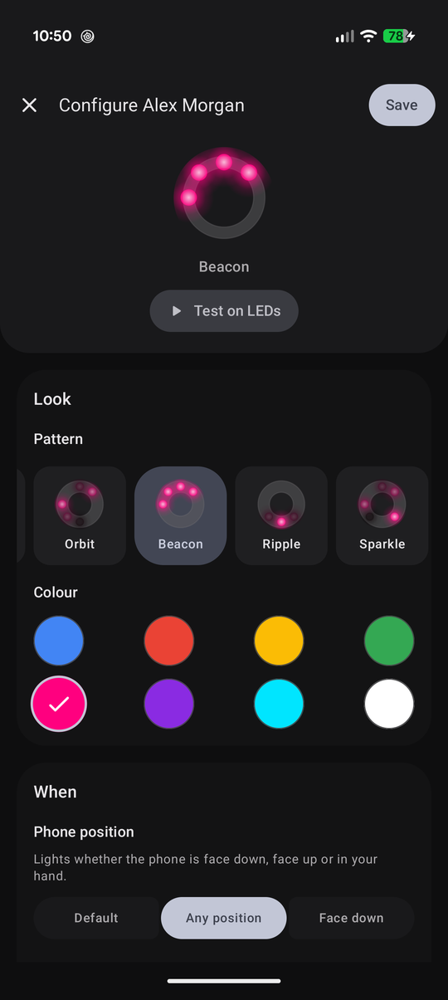
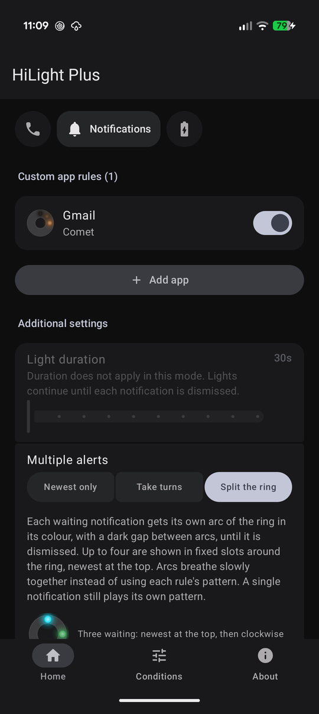
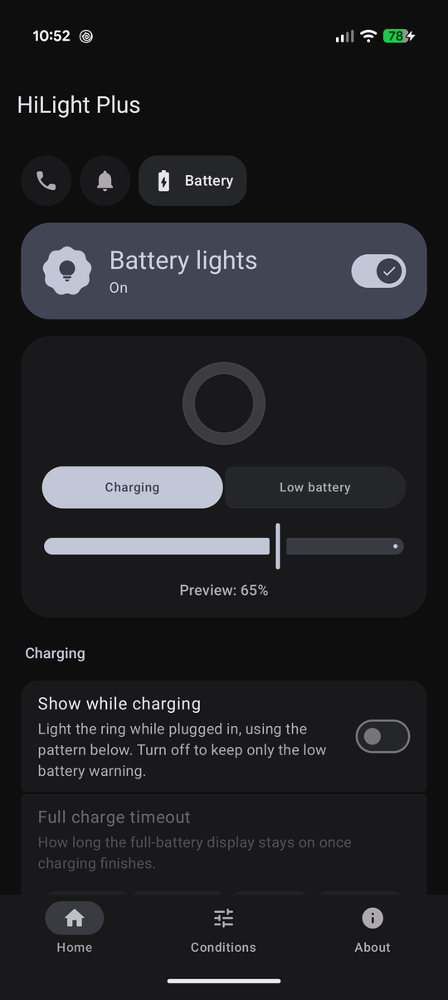

# HiLight Plus

Custom rear LED lighting for the Google Pixel 11 Pro.

Pixel's built-in HiLight lights the rear ring for two things: calls from favourites, and Gemini's listening, thinking and replying states. HiLight Plus replaces the first and leaves the second alone. It takes over the eight-LED ring behind the camera bar and lets you decide what it shows: a colour and pattern per contact or app, a charging gauge, a low-battery warning, and rules for when it should stay dark. Everything runs on-device with no accounts and no analytics; the only network use is the Google Play purchase.

<p align="center">
  
  
  
  
</p>

## Features

**Calls**
- A colour and pattern per contact, with separate defaults for all other saved contacts and for unknown numbers.
- A favourites style for your starred contacts, used when a caller has no rule of their own.
- Works for phone calls and for app calls such as WhatsApp, Teams and Meet. The ring lights until the call is answered or ended.
- An optional missed-call style, whoever called, that stays lit until the missed-call notification is dismissed.

**Notifications**
- Rules per message sender and per app, plus a general default with automatic colour taken from the app icon.
- Starred contacts can share a favourites style, which sits between a sender's own rule and the app rule.
- Ten patterns: solid, breathe, pulse, wave, comet, orbit, beacon, ripple, sparkle and rainbow.
- Three ways to handle several notifications at once:
  - *Newest only* lights the latest for a chosen duration.
  - *Take turns* plays each waiting notification's pattern in turn until it is dismissed.
  - *Split the ring* gives each waiting notification its own arc in its colour, up to four, newest at the top. The arcs can breathe, stay solid, brighten in turn (*Spotlight*) or circle the ring (*Rotate*).
- Lights stop when the notification is dismissed.

**Battery**
- Charging gauge, charge-fill or gradient ring while plugged in, with an automatic red-to-green colour by level or a fixed colour.
- Full-charge display with a configurable timeout.
- Low-battery warning below a threshold you choose.
- Battery sits underneath calls and notifications, or can be set to take priority over notifications.

**Conditions**
- Only light when the phone is face down.
- Skip during Do Not Disturb.
- Quiet hours with a daily window.
- Every rule can follow these defaults, always light, or opt out, and rules can carry their own quiet-hours window.

**Extras**
- Live preview of every pattern on a diffused ring mock-up, and a Test on LEDs button in each rule editor.
- Onboarding that connects to the ring, checks permissions and the stock HiLight setting that would otherwise fight for the ring, and explains the trial. Connecting is a self-ticking checklist: each switch is detected as you flip it, Settings opens at the right row, and a notification follows you there so you can type the pairing code without coming back to the app.
- People updating from a Shizuku-only version get a one-time prompt to switch to the built-in connection, which then keeps itself running across restarts.
- A live debug log on the About page, covering the app and the daemon, with one-tap clear and share. A shared report adds device and permission status, what the daemon is holding and every setting and rule, with contact names left out.
- A Reset lights button that restarts the daemon, freeing a ring stuck on a stale light session without restarting the phone. Waiting notifications and a ringing call light again once it reconnects. The app also checks the ring on unlock and resets automatically if the LEDs don't show what the daemon last sent.

## Requirements

- Google Pixel 11 Pro series running Android 17 (API 37). The app targets the rear `LIGHT_TYPE_APPLICATION` LEDs and will find none on other devices.
- Developer options turned on, and Wireless debugging for setup. Android does not let apps drive the rear lights directly, so HiLight Plus pairs once with the phone's own Wireless debugging and uses it to start a small daemon with shell permission that reaches the lights service. After that it reconnects by itself, including after a reboot.
- **To keep working:** Developer options stays on, and so does at least one of **USB debugging** or **Wireless debugging**. The daemon runs under the phone's debugging service, which Android stops when both are off.
  - With USB debugging on, the app switches Wireless debugging off again after each start.
  - With USB debugging off, Wireless debugging stays on. If you turn it off, the lights stop and the app switches it back on to restart them.
- Wi-Fi whenever the daemon needs starting (setup, a reboot, an update), because Wireless debugging only runs on Wi-Fi. Once running, it needs no network. On a Wi-Fi network where Wireless debugging has never been allowed, Android asks first; the app says what to do and carries on once you allow it.
- Or, instead, [Shizuku](https://shizuku.rikka.app/) running, over wireless debugging or root. It is still supported for anyone who already uses it.
- The stock "Calls from favourites" HiLight option turned off, otherwise both will try to drive the ring at once. Onboarding checks this for you. Gemini's own use of the ring is untouched: its state changes are not broadcast in a way an app can intercept in real time, so that stays stock behaviour.

## Permissions

| Permission | Why |
|---|---|
| Contacts | Tell saved callers and senders from unknown ones, spot starred favourites, match them to your rules, and pick contacts when creating a rule |
| Notification access | Notice incoming calls, new notifications and app calls, and know when they are dismissed |
| Internet | Connect to the phone's own Wireless debugging over loopback (127.0.0.1) to start the lights daemon. Nothing is sent off the device |
| Local network access | Find the pairing dialog, which Wireless debugging advertises over mDNS on the phone itself |
| Notifications | The setup guide that follows you into Settings and takes the pairing code |
| Run at startup | Start the lights daemon again after a reboot or an app update |
| Write secure settings | Granted by the daemon itself after the first connection, so the app can switch Wireless debugging on for a start (after a reboot, say), and off again straight after when USB debugging is on |
| Shizuku (optional) | Talk to the lights daemon over local Binder IPC, for people who start it through Shizuku |

No phone-state or call-log permission is used: incoming calls, cellular or app, are recognised from the dialer's own call notification. Contacts and notification content never leave the device. The only network activity off the phone is Google Play Billing for the purchase; the Wireless debugging connection is to the phone itself. See [PRIVACY_POLICY.md](PRIVACY_POLICY.md) for the full policy.

## How it works

The app has two halves:

- **The app process** hosts the UI, the notification listener and the battery receiver. It resolves each event against your rules and decides colour, pattern and conditions.
- **The daemon** (`HiLightDaemonService`) runs with shell UID. The app starts it itself over Wireless debugging (`WirelessAdb` pairs once, then launches `DaemonMain` through `app_process`, and the daemon hands its binder back through a content provider), or Shizuku starts it as a UserService. Only the app's UID may call it. It owns the render loop at roughly 30 frames per second, talks to `ILightsManager` through reflection, and applies live gating for face-down, Do Not Disturb and quiet hours so lights already playing react to changes. The app and daemon talk over an AIDL interface.

Face-down detection samples the accelerometer only while something is waiting to light, so there is no idle sensor cost.

## Building

Standard Android Gradle project. Open in Android Studio or run:

```bash
./gradlew :app:assembleDebug
```

```bash
./gradlew :app:testDebugUnitTest
```

Release builds are minified with R8. There is also a `debugMinified` variant, signed with the debug key, for checking the shrunk app on a device. Keep the `mapping.txt` from each release build for readable crash reports.

Unit tests cover the rule model, JSON round-tripping, contact matching, quiet hours, the pattern renderer, the battery and split-ring layouts, the call-state machine, the notification slot tracker and the connect-setup guide. Anything that touches the LEDs needs a physical Pixel.

## Pricing

The [Google Play](https://play.google.com/store/apps/details?id=com.mwilky.hilight.plus) build is free for 7 days, then a single one-off purchase unlocks it for good. No subscription. The trial starts the first time HiLight Plus connects to the ring and is recorded in a system setting, so it survives clearing app data.

The source is GPL-3.0 and you are welcome to build and install it yourself. A self-built APK is signed with your own key, so it cannot be updated from Play and does not include the purchase. Buying the Play version is the way to support development.

## Licence

GPL-3.0. See [LICENSE](LICENSE).
